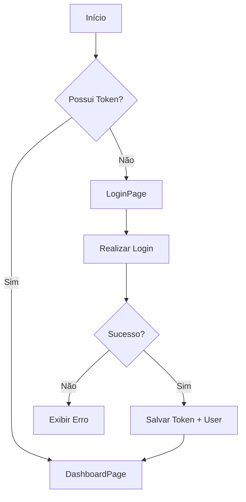
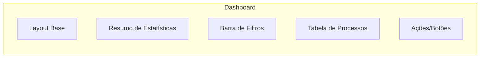

# 🎨 Arquitetura do Frontend - Gestão SEI

Este documento descreve a organização técnica, fluxo de dados e decisões de design da interface do Gestão SEI.

## 1. Stack Tecnológica
- **React 18**: Biblioteca base para construção da interface.
- **TypeScript**: Garantia de tipagem estática para maior segurança e produtividade.
- **Vite**: Ferramenta de build rápida para desenvolvimento moderno.
- **Tailwind CSS**: Framework utilitário para estilização responsiva e ágil.
- **Lucide React**: Biblioteca de ícones consistente.
- **Axios**: Cliente HTTP para consumo da API Backend.

## 2. Organização de Pastas
O projeto segue uma estrutura modular para facilitar a escalabilidade:

```text
src/
├── 📁 components/      # Componentes reutilizáveis (Layout, Filtros, Modais)
├── 📁 pages/           # Páginas completas da aplicação
├── 📁 assets/          # Imagens e estilos globais
├── 📄 api.ts           # Configuração centralizada do Axios e Interceptores
├── 📄 types.ts         # Definições de Interfaces TypeScript (Processo, Usuario, etc)
├── 📄 App.tsx          # Roteamento e Provedores de Contexto
└── 📄 main.tsx         # Ponto de entrada da aplicação
```

## 3. Fluxo de Navegação e Estados

### A. Diagrama de Fluxo de Autenticação
O sistema utiliza **JWT** armazenado no `localStorage` para persistência da sessão.



### B. Hierarquia de Componentes (Dashboard)
Representação de como a página principal é composta.



## 4. Integração com API
A comunicação com o backend é centralizada no arquivo `api.ts`, que implementa:
1. **URL Base Dinâmica**: Configurável via variáveis de ambiente.
2. **Interceptores de Requisição**: Inserção automática do `Authorization: Bearer <token>` em todas as chamadas para rotas protegidas.
3. **Interceptores de Resposta**: Detecção automática de erro `401 (Unauthorized)` para redirecionar o usuário ao login caso o token expire.

## 5. Tipagem (TypeScript)
Interfaces principais compartilhadas entre páginas e componentes:

| Interface | Descrição |
| :--- | :--- |
| **Processo** | Reflete os campos do SEI (número, tipo, status, prazo). |
| **Usuario** | Dados do perfil logado e controle de permissões (`role`). |
| **ImportacaoResultado** | Feedback visual do processamento de CSV no backend. |

## 6. UX/UI Design
- **Feedback Visual**: Uso de cores semânticas para prazos (Vermelho: Vencido, Laranja: Próximo ao vencimento).
- **Responsividade**: Layout adaptável para diferentes tamanhos de tela.
- **Documentação de Processos**: Acesso rápido ao histórico de tramitação diretamente pela listagem.
