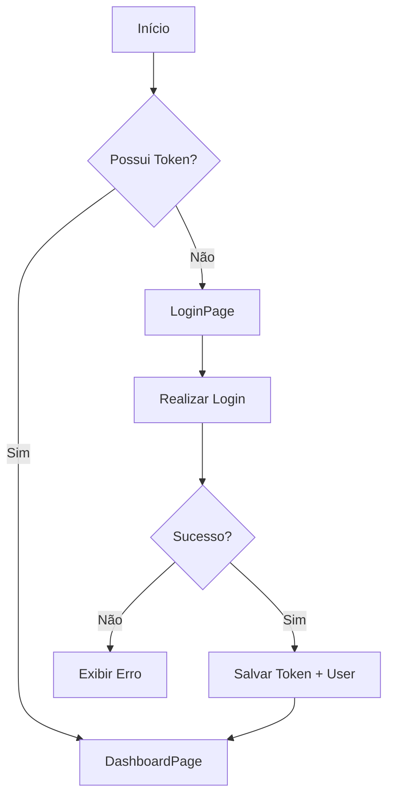
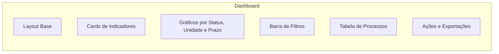

# 🎨 Arquitetura do Frontend - Gestão SEI

Este documento descreve a organização técnica, fluxo de dados e decisões de design da interface do Gestão SEI.

## 1. Stack Tecnológica

- **React 19**: Biblioteca base para construção da interface.
- **TypeScript**: Garantia de tipagem estática para maior segurança e produtividade.
- **Vite 8**: Ferramenta de build e servidor de desenvolvimento.
- **CSS próprio**: Estilos globais e responsivos centralizados em `src/index.css`.
- **Axios**: Cliente HTTP para consumo da API Backend.

## 2. Organização de Pastas

O projeto segue uma estrutura modular para facilitar a escalabilidade:

```text
src/
├── 📁 components/      # Componentes reutilizáveis (Layout, Filtros, Modais)
├── 📁 pages/           # Páginas completas da aplicação
├── 📁 assets/          # Imagens e estilos globais
├── 📄 api.ts           # Configuração centralizada do Axios e Interceptores
├── 📄 types.ts         # Definições de Interfaces TypeScript (Processo, Usuario, etc)
├── 📄 App.tsx          # Roteamento e Provedores de Contexto
└── 📄 main.tsx         # Ponto de entrada da aplicação
```

## 3. Fluxo de Navegação e Estados

### A. Diagrama de Fluxo de Autenticação

O sistema utiliza **JWT** armazenado no `localStorage` para persistência da sessão.


```mermaid
graph TD
    A[Início] --> B{Possui Token?}
    B -- Não --> C[LoginPage]
    B -- Sim --> D[DashboardPage]
    C --> E[Realizar Login]
    E --> F{Sucesso?}
    F -- Sim --> G[Salvar Token + User]
    G --> D
    F -- Não --> H[Exibir Erro]
```

### B. Hierarquia de Componentes (Dashboard)

Representação de como a página principal é composta.


```mermaid
graph BT
    subgraph Dashboard
        A[Layout Base]
        B[Cards de Indicadores]
        C[Gráficos por Status, Unidade e Prazo]
        D[Barra de Filtros]
        E[Tabela de Processos]
        F[Ações e Exportações]
    end
```

O dashboard calcula os indicadores e gráficos a partir dos processos atualmente exibidos. As barras de status e unidade são interativas e aplicam filtros à listagem.

## 4. Integração com API

A comunicação com o backend é centralizada no arquivo `api.ts`, que implementa:

1. **URL Base**: O cliente Axios usa `/api` como base. Em desenvolvimento, o Vite encaminha essa rota para `http://localhost:8081` e remove o prefixo antes de enviar ao backend.
2. **Interceptor de Requisição**: Inserção automática do cabeçalho `Authorization: Bearer <token>` quando existe token no `localStorage`.
3. **Interceptor de Resposta**: O `AuthProvider` trata respostas `401 (Unauthorized)`, remove a sessão local e faz o redirecionamento por meio da rota protegida.

As chamadas de processos, filtros, relatórios PDF, importação CSV e gestão de usuários são centralizadas em `src/api.ts`.

## 5. Tipagem (TypeScript)

Interfaces principais compartilhadas entre páginas e componentes:

| Interface | Descrição |
| :--- | :--- |
| **Processo** | Dados do processo, incluindo número, tipo, origem, unidade, status, prazo, observação e duplicata. |
| **Usuario** | Dados do perfil logado e controle de permissões (`role`). |
| **ImportacaoResultado** | Feedback visual do processamento de CSV no backend. |

## 6. UX/UI Design

- **Feedback Visual**: Uso de cores semânticas para prazos (vermelho: vencido, laranja: próximo ao vencimento e azul: acompanhamento por unidade).
- **Dashboard Gerencial**: Cards com percentuais, gráficos horizontais por status, unidade e faixa de prazo.
- **Filtros Interativos**: Clique nos gráficos para aplicar status ou unidade à listagem; o botão de limpeza remove o recorte atual.
- **Gestão de Prazos**: Separação visual entre vencidos, vencendo em até 5 dias, prazos acima de 5 dias e processos sem prazo definido.
- **Tema**: Alternância entre tema claro e escuro, persistida no `localStorage`.
- **Responsividade**: Layout adaptável para diferentes tamanhos de tela.
- **Documentação de Processos**: Acesso rápido ao histórico de tramitação diretamente pela listagem.
- **Perfis**: Menus de usuários e importação de CSV ficam disponíveis somente para `ADMIN`.
