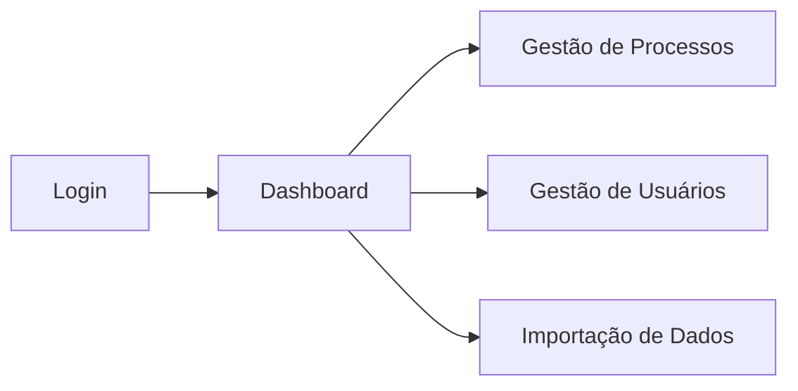

# 🎨 Gestão SEI Frontend

[](https://reactjs.org/)
[](https://www.typescriptlang.org/)
[](https://tailwindcss.com/)
[](https://vitejs.dev/)

> 💻 Interface moderna e responsiva para o controle de processos administrativos do SEI.

## 📋 Sobre o Projeto

O **Gestão SEI Frontend** oferece uma experiência intuitiva para que servidores públicos gerenciem seus processos. Com um dashboard focado em produtividade, o sistema destaca prazos críticos e facilita a tramitação de documentos.

## 🛠️ Arquitetura Técnica

A aplicação foi construída com foco em performance e tipagem forte. Para entender a estrutura de componentes, fluxo de autenticação e integração com a API, acesse:

👉 **[Documentação de Arquitetura (Frontend)](ARQUITETURA.md)**

### Visão Geral da Interface


## ✨ Funcionalidades Principais

- 🔐 **Autenticação Segura**: Gestão de sessão via JWT com redirecionamento automático.
- 📊 **Dashboard Inteligente**: Cards com métricas de processos abertos, concluídos e expirados.
- 🔍 **Busca em Tempo Real**: Filtros dinâmicos e busca global por palavras-chave.
- 📅 **Gestão de Prazos**: Alertas visuais coloridos baseados na proximidade do vencimento.
- 📥 **Importação de CSV**: Interface amigável para carga de dados em massa com feedback de erros.
- 📄 **Histórico Detalhado**: Visualização em linha do tempo das tramitações de cada processo.

## 🚀 Como Executar

**Pré-requisitos:** Node.js (v18+) e npm/yarn.

1. **Instalar dependências:**
   ```bash
   npm install
   ```
2. **Configurar variáveis de ambiente:**
   Crie um arquivo `.env` baseado no `.env.example` apontando para a URL do seu backend.
3. **Rodar em desenvolvimento:**
   ```bash
   npm run dev
   ```

## 🏗️ Estrutura do Projeto
```text
src/
├── 📁 components/  # Botões, Modais, Cards, Layout
├── 📁 pages/       # Login, Dashboard, Usuários, Histórico
├── 📁 api.ts       # Cliente Axios com Interceptores
└── 📁 types.ts     # Interfaces TypeScript
```

---
Made with ❤️ by Gilvaneide Medeiros
